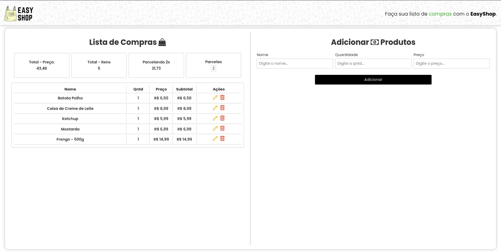

# EasyShop 👜

## Descrição

EasyShop é uma aplicação web progressiva (PWA) desenvolvida para a criação de listas de compras de maneira rápida e fácil. Este projeto foi criado como parte de uma avaliação de programação para dispositivos móveis, visando proporcionar uma experiência de usuário agradável e funcional.

## Funcionalidades 🚀

- **Criação de Listas de Compras:** Adicione produtos à sua lista de compras com nome e quantidade desejada.
- **Edição de Produtos:** Modifique as informações dos produtos conforme necessário.
- **Exclusão de Produtos:** Remova itens da sua lista de compras de maneira simples e rápida.
- **Notificações:** Receba notificações para lembrá-lo de itens importantes ou outras atualizações da lista.
- **Armazenamento Local:** Salve suas listas de compras utilizando o Local Storage do navegador, garantindo que seus dados permaneçam disponíveis mesmo offline.
- **PWA:** Instale EasyShop no seu dispositivo móvel para um acesso mais rápido e uma experiência de aplicativo nativa.

## Qualidades ➕

- **Layout Adaptativo:** Interface responsiva que se ajusta a diferentes dispositivos, incluindo celulares, tablets e computadores.
- **Instalação Fácil:** Como uma PWA, EasyShop pode ser facilmente instalado no seu dispositivo móvel diretamente do navegador.
- **Experiência Standalone:** Uma vez instalado, EasyShop funciona de maneira independente do navegador, proporcionando uma experiência de uso mais fluida.
- **Suporte a Notificações:** Mantenha-se informado com notificações integradas que ajudam a gerenciar suas listas de compras.

## Configurações Técnicas ⚙️

### Manifesto Web

O manifesto web define como a aplicação deve ser exibida ao usuário e fornece informações essenciais para a instalação da PWA.

```json
{
    "name": "EasyShop",
    "short_name": "EasyShop",
    "description": "Uma aplicação para a criação de uma lista de compras de maneira rápida e fácil.",
    "start_url": "./index.html",
    "display": "standalone",
    "orientation": "portrait",
    "lang": "pt-BR",
    "theme_color": "white",
    "background_color": "white",
    "id": "./index.html",
    "prefer_related_applications": false,
    "icons": [
        {
            "src": "./assets/img/icon144.png",
            "sizes": "144x144",
            "type": "image/png"
        },
        {
            "src": "./assets/img/icon192.png",
            "sizes": "192x192",
            "type": "image/png"
        },
        {
            "src": "./assets/img/icon512.png",
            "sizes": "512x512",
            "type": "image/png"
        }
    ],
    "screenshots": [
        {
            "src": "./assets/img/screenshot.jpeg",
            "sizes": "1600x805",
            "type": "image/png",
            "form_factor": "wide"
        },
        {
            "src": "./assets/img/screenshot_2.png",
            "sizes": "480x640",
            "type": "image/png",
            "form_factor": "narrow"
        }
    ],
    "protocol_handlers": [
        {
            "protocol": "web+myprotocol",
            "url": "/?protocol=%s"
        }
    ]
}
```

## Layout 🖥️


## Tecnologias Utilizadas

- **HTML5** 
- **CSS3** 
- **JavaScript** 
- **Local Storage** 
- **Service Worker** 

## Como Utilizar

1. **Clone o Repositório:** Clone o repositório para sua máquina local.
2. **Rode localmente:** Rode um servidor local com liveserver, xampp ou qualquer outro de sua preferência.

## Contribuições

Sinta-se à vontade para contribuir com o EasyShop. Para isso, siga as etapas abaixo:

1. **Fork o Repositório**
2. **Crie uma Branch:** `git checkout -b feature/AmazingFeature`
3. **Commit suas Modificações:** `git commit -m 'Add some AmazingFeature'`
4. **Push para a Branch:** `git push origin feature/AmazingFeature`
5. **Abra um Pull Request**

---

**Obrigado pela atenção 😊**
